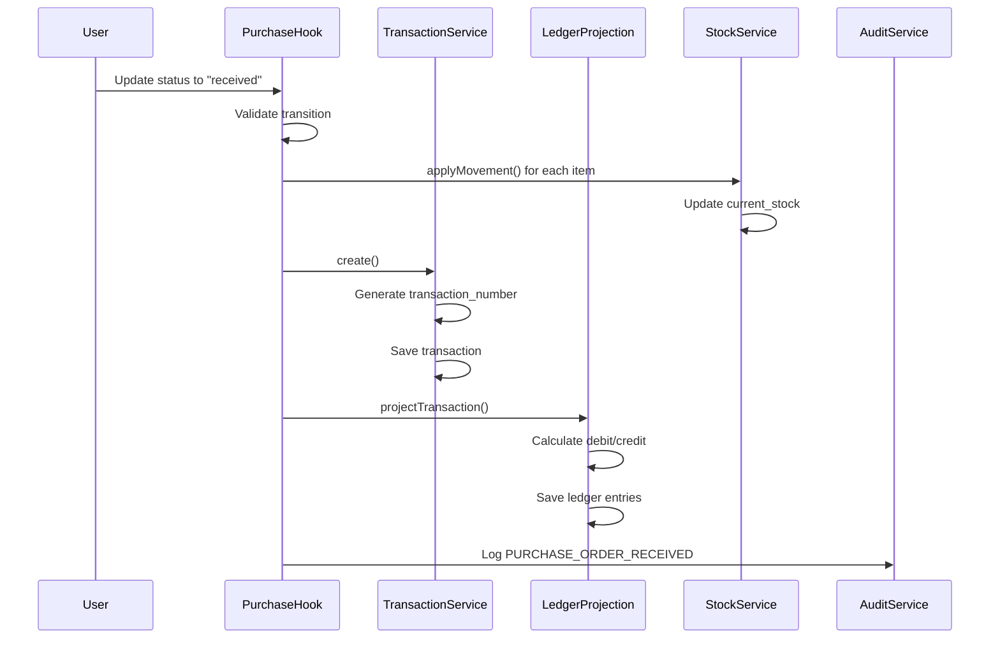
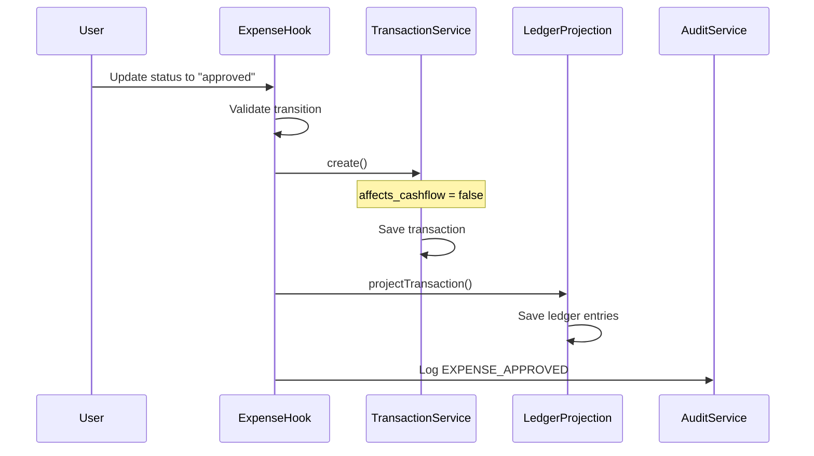
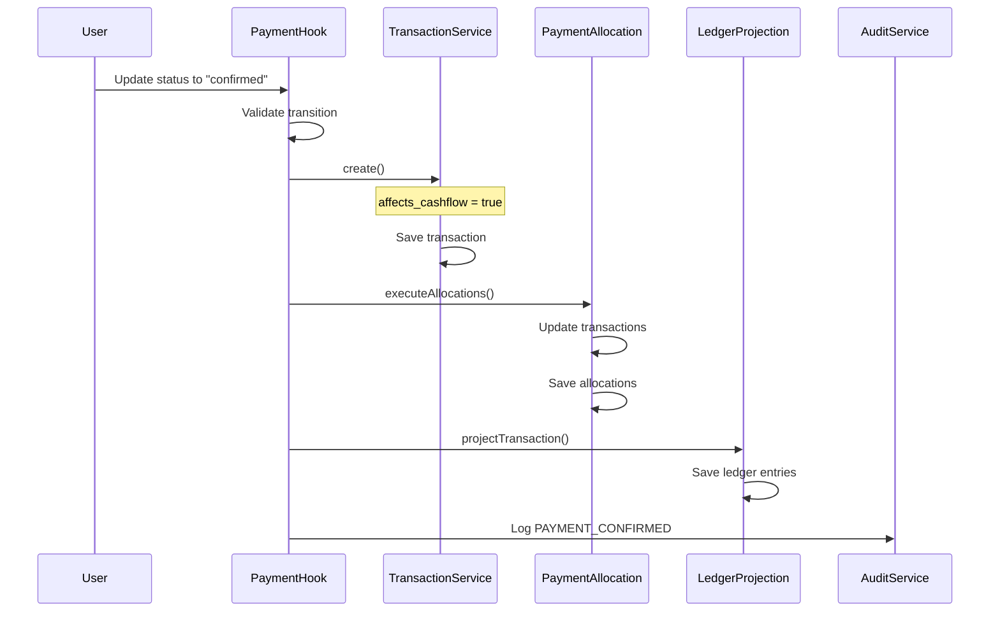
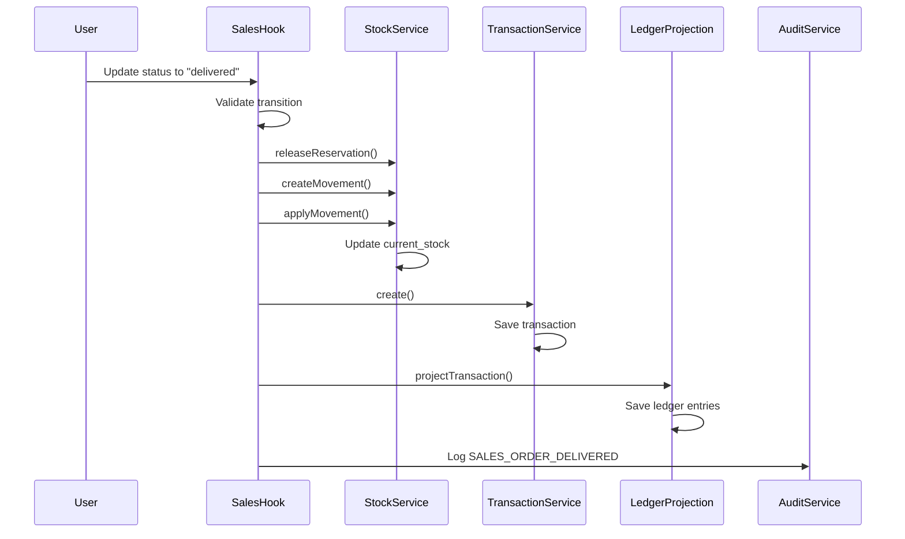
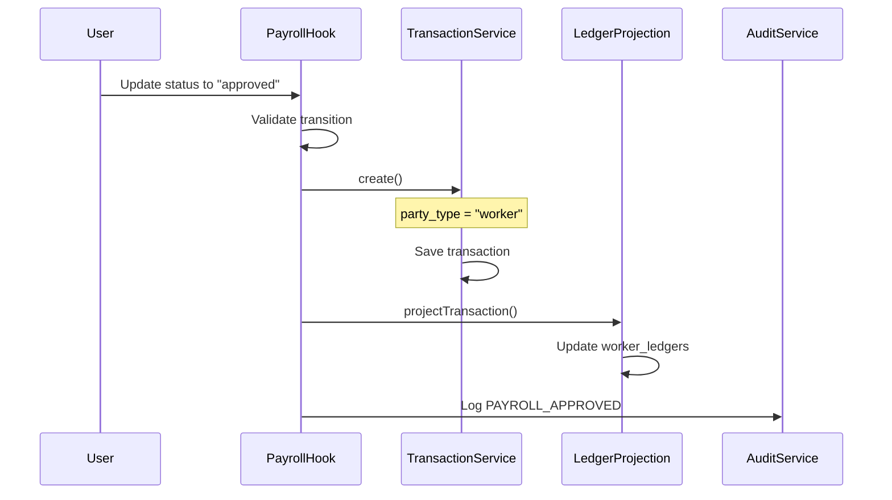

# Event Flow Documentation

## Purchase Flow

```mermaid
sequenceDiagram
    participant User
    participant PurchaseHook
    participant TransactionService
    participant LedgerProjection
    participant StockService
    participant AuditService

    User->>PurchaseHook: Update status to "received"
    PurchaseHook->>PurchaseHook: Validate transition
    PurchaseHook->>StockService: applyMovement() for each item
    StockService->>StockService: Update current_stock
    PurchaseHook->>TransactionService: create()
    TransactionService->>TransactionService: Generate transaction_number
    TransactionService->>TransactionService: Save transaction
    PurchaseHook->>LedgerProjection: projectTransaction()
    LedgerProjection->>LedgerProjection: Calculate debit/credit
    LedgerProjection->>LedgerProjection: Save ledger entries
    PurchaseHook->>AuditService: Log PURCHASE_ORDER_RECEIVED
```

## Expense Flow

```mermaid
sequenceDiagram
    participant User
    participant ExpenseHook
    participant TransactionService
    participant LedgerProjection
    participant AuditService

    User->>ExpenseHook: Update status to "approved"
    ExpenseHook->>ExpenseHook: Validate transition
    ExpenseHook->>TransactionService: create()
    Note over TransactionService: affects_cashflow = false
    TransactionService->>TransactionService: Save transaction
    ExpenseHook->>LedgerProjection: projectTransaction()
    LedgerProjection->>LedgerProjection: Save ledger entries
    ExpenseHook->>AuditService: Log EXPENSE_APPROVED
```

## Payment Flow

```mermaid
sequenceDiagram
    participant User
    participant PaymentHook
    participant TransactionService
    participant PaymentAllocation
    participant LedgerProjection
    participant AuditService

    User->>PaymentHook: Update status to "confirmed"
    PaymentHook->>PaymentHook: Validate transition
    PaymentHook->>TransactionService: create()
    Note over TransactionService: affects_cashflow = true
    TransactionService->>TransactionService: Save transaction
    PaymentHook->>PaymentAllocation: executeAllocations()
    PaymentAllocation->>PaymentAllocation: Update transactions
    PaymentAllocation->>PaymentAllocation: Save allocations
    PaymentHook->>LedgerProjection: projectTransaction()
    LedgerProjection->>LedgerProjection: Save ledger entries
    PaymentHook->>AuditService: Log PAYMENT_CONFIRMED
```

## Sales Flow

```mermaid
sequenceDiagram
    participant User
    participant SalesHook
    participant StockService
    participant TransactionService
    participant LedgerProjection
    participant AuditService

    User->>SalesHook: Update status to "delivered"
    SalesHook->>SalesHook: Validate transition
    SalesHook->>StockService: releaseReservation()
    SalesHook->>StockService: createMovement()
    SalesHook->>StockService: applyMovement()
    StockService->>StockService: Update current_stock
    SalesHook->>TransactionService: create()
    TransactionService->>TransactionService: Save transaction
    SalesHook->>LedgerProjection: projectTransaction()
    LedgerProjection->>LedgerProjection: Save ledger entries
    SalesHook->>AuditService: Log SALES_ORDER_DELIVERED
```

## Payroll Flow

```mermaid
sequenceDiagram
    participant User
    participant PayrollHook
    participant TransactionService
    participant LedgerProjection
    participant AuditService

    User->>PayrollHook: Update status to "approved"
    PayrollHook->>PayrollHook: Validate transition
    PayrollHook->>TransactionService: create()
    Note over TransactionService: party_type = "worker"
    TransactionService->>TransactionService: Save transaction
    PayrollHook->>LedgerProjection: projectTransaction()
    LedgerProjection->>LedgerProjection: Update worker_ledgers
    PayrollHook->>AuditService: Log PAYROLL_APPROVED
```
